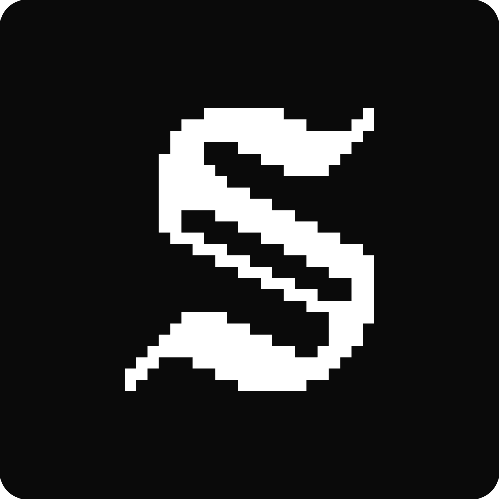
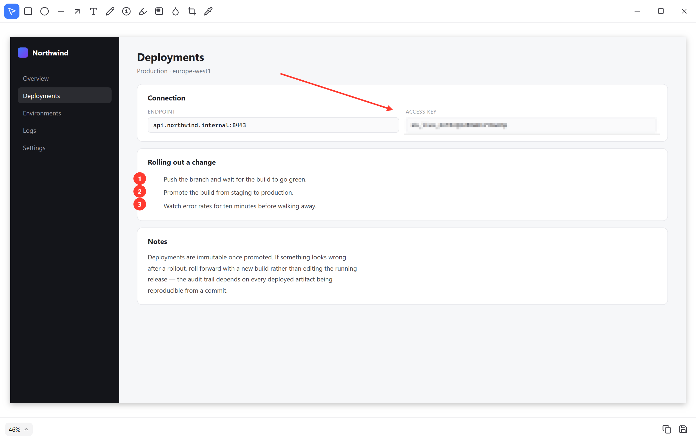

<p align="center">
  
</p>

<h1 align="center">Shota</h1>

<p align="center">
  A free, native Windows screenshot &amp; annotation tool.
  <br>
  <a href="https://github.com/JulienHe/shota/releases/latest"><strong>Download for Windows →</strong></a>
</p>

<p align="center">
  <a href="https://github.com/JulienHe/shota/releases/latest"></a>
  <a href="LICENSE"></a>
  
</p>

Shota runs as a background/tray app: no taskbar window, just a tray icon with quick capture actions and a "Keyboard Shortcuts…" entry that opens the small settings window. Capture something and it opens in a lightweight annotation editor with its own title bar (toolbar merged into the same row as the window controls) and a bottom status bar for zoom/copy/save.

Nothing is uploaded anywhere. Captures, annotations and history all stay on your machine.

<p align="center">
  
</p>

## Install

Grab the latest installer from the [releases page](https://github.com/JulienHe/shota/releases/latest). Windows 10 or 11.

Windows SmartScreen will likely warn you on first run — the installer isn't code-signed yet. "More info" → "Run anyway".

## Features

**Capture**
- Full screen, drag-select area, or snap to a window (press `Space` while selecting an area)
- Trigger from the global shortcuts or the tray icon menu
- Every capture is kept in a local history you can reopen later, annotations and all
- The area-selection overlay is excluded from screen capture at the OS compositor level, so its own selection chrome never ends up baked into the screenshot

**Annotate**
- Shapes: rectangle, ellipse, line, arrow, text, freehand pen
- Numbered step badges that auto-increment, for walking through a sequence
- Highlighter: swipe over text like a real marker, with the background showing through rather than being covered
- Spotlight: dim everything except a region you drag out, with adjustable corner radius and dimming colour
- Redaction: blur / pixelate tool for hiding sensitive content
- Crop, in-canvas zoom & pan
- Color picker (eyedropper) with a live magnified loupe — click to sample and copy the hex value
- Per-tool style controls live inline in the title bar as small dropdowns: colour (with a custom-colour picker), stroke width, line style (solid/dashed/dotted), fill (none/solid/translucent), corner radius, font size, and the full list of fonts actually installed on your system
- Text tool is IME-aware (composing Japanese/Chinese/Korean input doesn't prematurely submit the text box)
- Undo/redo, and Delete/Backspace to remove the selected shape
- Right-click the canvas background to switch it between white, a few grays, black, or "match system"

**Speak your language**
- English, French, German, Spanish, Japanese, Korean and Simplified Chinese
- Follows your Windows language automatically, with an override in the shortcuts window
- Translations live in `locales/` as plain JSON — corrections and new languages are a small pull request

**Finish up**
- Copy to clipboard or save as PNG (remembers the last folder you saved to, falls back to Desktop) — both close the editor immediately rather than lingering
- Zoom control and Copy/Save live in a bottom status bar, mirroring the toolbar up top

## Keyboard shortcuts

### Global

| Shortcut | Action |
| --- | --- |
| `Ctrl+Shift+3` | Capture full screen |
| `Ctrl+Shift+4` | Capture area / window (press `Space` to snap to a window) |
| `Ctrl+Shift+6` | Open the capture history carousel |

Global shortcuts are rebindable from the tray icon's "Keyboard Shortcuts…" window.

### In the editor

| Shortcut | Action |
| --- | --- |
| `Ctrl+C` | Copy the current edit to the clipboard |
| `Ctrl+S` | Save as… |
| `Ctrl+Z` / `Ctrl+Shift+Z` | Undo / redo |
| `Delete` / `Backspace` | Delete the selected shape |
| `Space` (hold) | Pan the canvas |
| `Esc` | Cancel a capture in progress |

### Tools

| Key | Tool | | Key | Tool |
| --- | --- | --- | --- | --- |
| `V` | Select | | `N` | Numbered step |
| `R` | Rectangle | | `H` | Highlighter |
| `O` | Ellipse | | `S` | Spotlight |
| `L` | Line | | `B` | Blur / pixelate |
| `A` | Arrow | | `C` | Crop |
| `T` | Text | | `I` | Color picker |
| `P` | Freehand pen | | | |

## Feedback, bugs and feature requests

- **Something broken?** [Open a bug report](https://github.com/JulienHe/shota/issues/new?template=bug_report.yml) — the template asks for your Windows version and what you were capturing, which is usually what it comes down to.
- **Want a tool or an option that isn't there?** [Open a feature request](https://github.com/JulienHe/shota/issues/new?template=feature_request.yml).
- **Not sure, or want to talk it through?** Use [Discussions](https://github.com/JulienHe/shota/discussions).

Shota is a side project, so responses may not be instant — but every issue gets read.

## Contributing

Pull requests are welcome. For anything beyond a small fix, open an issue first so we can agree on the approach before you spend time on it.

```bash
npm install
npm run tauri dev
```

Before opening a PR, please make sure both of these pass:

```bash
npx tsc --noEmit          # frontend types
cd src-tauri && cargo build   # not just `cargo check` — only a real build links
```

### Screenshots

The images in this README are generated, not posed:

```bash
npm run dev          # in one terminal
npm run screenshots  # in another
```

That renders the real frontend in headless Chromium against a fake Tauri backend
(`screenshots/`), draws the annotations with real mouse input, and writes
`docs/screenshots/`. Re-run it after a UI change rather than re-staging shots by hand.

`CLAUDE.md` in the repo root documents the non-obvious constraints that have already caused bugs here (build profile traps, how large images cross the IPC boundary, window reuse and stale per-mount state). Worth a skim before changing anything in those areas.

## Security and code signing

Releases are built by GitHub Actions from the source in this repository
(`.github/workflows/release.yml`), never from a maintainer's machine, and every
release is published from a tagged commit.

Updates are verified before they are installed. Each installer carries a signature
made with a key held outside the repository, and the app checks it against a public
key compiled into the binary — an installer that wasn't produced by this project is
rejected rather than run. The private key is never present in CI logs, the repository,
or any published artifact.

Shota collects nothing and sends nothing anywhere. The only network request it makes
is to GitHub, to ask whether a newer release exists — and the Microsoft Store build
makes none at all, since the Store handles updates itself. See the full
[privacy policy](PRIVACY.md).

## Tech stack

- [Tauri 2](https://tauri.app/) (Rust) for the native shell, global shortcuts, screen/window capture ([xcap](https://github.com/nashaofu/xcap)), clipboard and file save
- React + TypeScript + Vite for the UI
- [Konva](https://konvajs.org/) / react-konva for the annotation canvas
- [Zustand](https://github.com/pmndrs/zustand) for state
- [Lucide](https://lucide.dev/) for icons

## Project layout

- `src-tauri/src/capture` — screen, region, and window capture (xcap)
- `src-tauri/src/windows` — overlay, editor and history window lifecycle
- `src-tauri/src/tray.rs` — the tray icon and its menu (capture actions, shortcuts, quit)
- `src-tauri/src/hotkeys.rs`, `clipboard.rs`, `file_save.rs`, `state.rs`, `history.rs` — global shortcuts, clipboard, save-dialog/last-folder persistence, capture history
- `src-tauri/src/fonts.rs` — system font enumeration (DirectWrite)
- `src/windows` — one component per Tauri window (`MainWindow` is the hidden-by-default shortcuts/settings window, `CaptureOverlay`, `EditorWindow`, `HistoryBar`, plus the shared `TitleBar`/`BottomBar`), routed by window label in `App.tsx`
- `src/features/annotate` — the canvas, shape components, toolbar, and per-tool style dropdowns
- `src/features/crop`, `src/features/zoom`, `src/features/color-picker` — image manipulation tools
- `src/stores` — Zustand stores (`toolStore` for the active tool/style, `documentStore` for shapes/undo-redo, `uiStore` for canvas background, `toastStore` for the shared confirmation toast)

## Build

```bash
npm run tauri build
```

## License

[MIT](LICENSE) © Julien Henrotte
