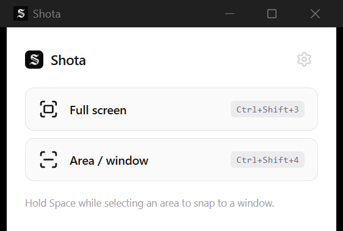

<p align="center">
  
</p>

# Shota

A free, native Windows screenshot & annotation tool — the kind of thing [CleanShot X](https://cleanshot.com/) / [Shottr](https://shottr.cc/) are on macOS.

Shota runs as a background/tray app: no taskbar window, just a tray icon with quick capture actions and a "Keyboard Shortcuts…" entry that opens the small settings window. Capture something and it opens in a lightweight annotation editor with its own CleanShot-style title bar (toolbar merged into the same row as the window controls) and a bottom status bar for zoom/copy/save.

<p align="center">
  
</p>

## Features

**Capture**
- Full screen, drag-select area, or snap to a window (hold `Space` while selecting an area)
- Trigger from the global shortcuts or the tray icon menu
- The area-selection overlay is excluded from screen capture at the OS compositor level, so its own selection chrome never ends up baked into the screenshot

**Annotate**
- Shapes: rectangle, ellipse, line, arrow, text, freehand pen
- Redaction: blur / pixelate tool for hiding sensitive content
- Crop, in-canvas zoom & pan
- Color picker (eyedropper) with a live magnified loupe — click to sample and copy the hex value
- Per-tool style controls live inline in the title bar as small dropdowns (CleanShot-style): stroke color (with a gradient custom-color picker), stroke width, line style (solid/dashed/dotted), fill (none/solid/translucent), corner radius, font size, and the full list of fonts actually installed on your system
- Text tool is IME-aware (composing Japanese/Chinese/Korean input doesn't prematurely submit the text box)
- Undo/redo, and Delete/Backspace to remove the selected shape
- Right-click the canvas background to switch it between white, a few grays, black, or "match system"

**Finish up**
- Copy to clipboard or save as PNG (remembers the last folder you saved to, falls back to Desktop) — both close the editor immediately rather than lingering
- Zoom control and Copy/Save live in a bottom status bar, mirroring the toolbar up top

## Keyboard shortcuts

| Shortcut | Action |
| --- | --- |
| `Ctrl+Shift+3` | Capture full screen (global) |
| `Ctrl+Shift+4` | Capture area / window (global, hold `Space` to snap to a window) |
| `Ctrl+C` | Copy the current edit to the clipboard |
| `Ctrl+S` | Save as… |
| `Ctrl+Z` / `Ctrl+Shift+Z` | Undo / redo |
| `Delete` / `Backspace` | Delete the selected shape |
| `Esc` | Cancel a capture in progress |

Global shortcuts are rebindable from the tray icon's "Keyboard Shortcuts…" window.

## Tech stack

- [Tauri 2](https://tauri.app/) (Rust) for the native shell, global shortcuts, screen/window capture ([xcap](https://github.com/nashaofu/xcap)), clipboard and file save
- React + TypeScript + Vite for the UI
- [Konva](https://konvajs.org/) / react-konva for the annotation canvas
- [Zustand](https://github.com/pmndrs/zustand) for state
- [Lucide](https://lucide.dev/) for icons

## Project layout

- `src-tauri/src/capture` — screen, region, and window capture (xcap)
- `src-tauri/src/windows` — overlay & editor window lifecycle
- `src-tauri/src/tray.rs` — the tray icon and its menu (capture actions, shortcuts, quit)
- `src-tauri/src/hotkeys.rs`, `clipboard.rs`, `file_save.rs`, `state.rs` — global shortcuts, clipboard, save-dialog/last-folder persistence
- `src-tauri/src/fonts.rs` — system font enumeration (DirectWrite)
- `src/windows` — one component per Tauri window (`MainWindow` is the hidden-by-default shortcuts/settings window, `CaptureOverlay`, `EditorWindow`, plus the shared `TitleBar`/`BottomBar`), routed by window label in `App.tsx`
- `src/features/annotate` — the canvas, shape components, toolbar, and per-tool style dropdowns
- `src/features/crop`, `src/features/zoom`, `src/features/color-picker` — image manipulation tools
- `src/stores` — Zustand stores (`toolStore` for the active tool/style, `documentStore` for shapes/undo-redo, `uiStore` for canvas background, `toastStore` for the shared confirmation toast)

## Development

```bash
npm install
npm run tauri dev
```

## Build

```bash
npm run tauri build
```
